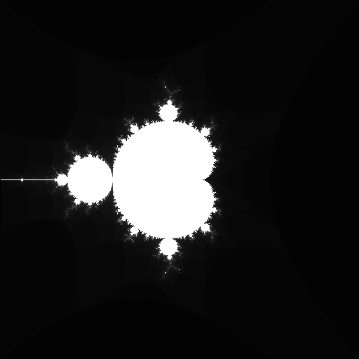

# JavaScript Fractal Generator

This program generates fractal images using JavaScript and the Canvas API.

It is currently a quick and dirty proof concept.
Parameters for the below view of the Mandelbrot fractal are hard coded in [script.js](./script.js)

